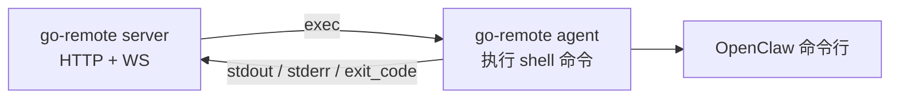
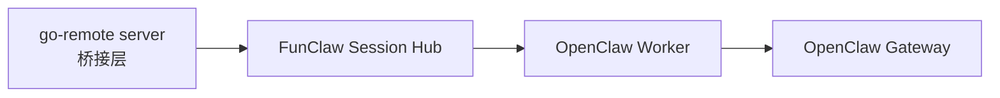

# go-remote 与 FunClaw Session Hub 适配方案

## 1. 先说结论

我把 `go-remote` 拉下来看过了。

一句话判断：

> `go-remote` 现在本质上是一个“远程命令执行系统”，它最适合接到 **Session Hub 的 HTTP 接入面**，作为一个上层 Adapter，而不是替代 Hub 或替代 Worker。

也就是说，最顺的接法不是：

- 让 `go-remote` 直接变成 `Hub`
- 也不是让 `go-remote` 直接替代 `OpenClaw Worker`

而是：

> **保留现有 Session Hub + Worker 架构，把 go-remote 的 `/api/openclaw` 改成一个“调用 Session Hub 的桥接接口”。**

这样改动最小，也最符合两边现在各自的职责。

---

## 2. go-remote 现在到底是什么

`go-remote` 当前结构很清楚：

- 服务端：
  - 提供 HTTP API
  - 提供 `/ws`
  - 管理在线 agent
  - 下发 shell 命令
- 客户端 agent：
  - 主动连服务端
  - 接 `exec`
  - 在本机执行 shell 命令
  - 回传 stdout / stderr / exit code

关键入口：

- 服务端入口：`cmd/server/main.go:22`
- WebSocket 和 HTTP 路由：`internal/server/server.go:64`
- 通用下发命令接口：`internal/server/api.go:68`
- 现在的 OpenClaw 专用接口：`internal/server/api.go:189`
- agent 执行命令：`internal/agent/handler.go:97`
- shell 执行器：`internal/agent/executor.go:29`

它当前的数据面是这样的：



所以你要先明确一件事：

> `go-remote` 当前不是一个 OpenClaw 协议层，它只是一个“远程跑命令”的控制台。

---

## 3. 它和当前 Session Hub 哪些地方不一样

### 3.1 go-remote 是“命令执行模型”

现在 `go-remote` 的 OpenClaw 接口 `internal/server/api.go:169` 做的事情其实很粗暴：

- 收到 `/api/openclaw`
- 把请求拼成一条 shell 命令
- 下发给指定 agent 执行

核心代码在：

- `internal/server/api.go:216`

它实际拼的是：

```text
openclaw agent --session-id <...> --message '<...>'
```

### 3.2 Session Hub 是“协议路由模型”

而我们现在的 Session Hub 不是发 shell 命令。

它是：

- 先创建 / 确认 session
- 再投递 request
- Hub 根据 `session_id -> worker_id` 路由
- Worker 调本机 OpenClaw Gateway
- Hub 统一记录 request 状态 / artifact

关键入口在：

- `src/funclaw/hub/server.ts:268`：建 session
- `src/funclaw/hub/server.ts:295`：发消息
- `src/funclaw/hub/server.ts:346`：await request
- `src/funclaw/hub/store.ts:150`：维护 `session_id -> worker_id`
- `src/funclaw/worker/run.ts:30`：Worker 收任务后调用本机 OpenClaw

所以两边最大的区别是：

| 维度 | go-remote | Session Hub |
| --- | --- | --- |
| 核心模型 | 下发 shell 命令 | 下发结构化 request |
| 会话粘性 | 没有 | 有，靠 `session_id -> worker_id` |
| 结果模型 | stdout / stderr / exit code | `RequestRecord` + artifact |
| 多媒体能力 | 目前没有协议层支持 | 已支持 artifact / node.invoke |
| 路由单位 | `client_id` | `session_id` |
| 执行方式 | agent 跑命令 | Worker 调 Gateway API |

---

## 4. 为什么不建议让 go-remote 直接替代 Worker

表面上看，`go-remote agent` 也会主动长连，也会接任务，像不像 Worker？

像，但不能直接拿来顶。

原因有 4 个：

### 4.1 它的协议太粗

`go-remote` 的消息只有：

- `register`
- `exec`
- `result`
- `ping`
- 文件传输

定义在：

- `internal/common/message.go:5`

但 Session Hub 需要的是：

- `task.assigned`
- `task.accepted`
- `task.completed`
- `task.failed`
- `artifact.register`

这不是小改，是协议模型完全不同。

### 4.2 它返回的是 shell 输出，不是结构化 OpenClaw 结果

现在 `go-remote agent` 执行完命令，只会返回：

- `stdout`
- `stderr`
- `exit_code`

见：

- `internal/common/message.go:35`
- `internal/server/handler.go:110`

但 Session Hub 需要的不是“这条命令有没有跑完”，而是：

- 文本结果
- request 生命周期
- artifact 列表
- 失败结构

### 4.3 它没有 session sticky

Session Hub 最关键的一层是：

```text
session_id -> worker_id
```

见：

- `src/funclaw/hub/store.ts:150`

而 `go-remote` 现在是“你指定 `client_id`，我就发给它”，不负责会话路由。

### 4.4 它的 OpenClaw 接口现在是 shell 拼接，风险和能力都不够

现有实现：

- `internal/server/api.go:216`

直接把用户消息拼进 shell 命令，这一层：

- 容易受引号和转义影响
- 不适合多模态输入
- 不适合 artifact 回传
- 不适合做稳定联调

---

## 5. 最推荐的接法

## 5.1 角色定位

最推荐的定位是：

> **让 go-remote server 扮演“FunClaw Adapter / 上层桥接器”，通过 Hub HTTP API 把请求转进现有 Session Hub。**

此时角色会变成：



go-remote 自己原来的通用能力仍然保留：

- `/api/exec` 继续下发 shell 命令
- `/ws` 和 agent 体系继续保留

但 OpenClaw 专用链路不再走 shell。

---

## 5.2 具体怎么改

### 第一步：保留 go-remote 的 server，不动它的总框架

保留这些现有能力：

- `internal/server/server.go:73` 的 `/ws`
- `internal/server/api.go:68` 的 `/api/exec`
- `internal/server/api.go:140` 的任务查询

这些跟 Session Hub 不冲突。

### 第二步：重写 `/api/openclaw`

当前的 `/api/openclaw` 不要再做：

- 拼 shell 命令
- 发给 go-remote agent 执行

而是改成：

1. 调 Hub `POST /api/v1/sessions`
2. 调 Hub `POST /api/v1/sessions/:sessionId/messages`
3. 调 Hub `POST /api/v1/requests/:requestId/await`
4. 如果有 artifact，再按需读 Hub artifact 接口

也就是把 `internal/server/api.go:189` 改造成一个 **Hub HTTP Client**。

### 第三步：给 go-remote server 增加 Session Hub 配置

建议在 `internal/server/config.go` 里新增一段配置，例如：

```yaml
session_hub:
  base_url: "http://127.0.0.1:31880"
  token: "REPLACE_ME"
  adapter_id: "go-remote-server"
  await_timeout_ms: 30000
```

### 第四步：新增一个 Hub Client 封装

建议新加一个文件，例如：

- `internal/server/session_hub_client.go`

职责只做 4 件事：

1. `EnsureSession`
2. `SendMessage`
3. `AwaitRequest`
4. `GetArtifactMeta / DownloadArtifact`

不要把 Hub 协议散落在 `api.go` 里。

---

## 6. 字段怎么映射

当前 `go-remote` 的 OpenClaw 请求长这样：

见：

- `internal/server/api.go:170`

```json
{
  "client_id": "xxx",
  "user_id": "u1",
  "session_id": "s1",
  "message": "你好",
  "timeout": 30
}
```

接到 Session Hub 后，建议这样映射：

| go-remote 字段 | Session Hub 字段 | 说明 |
| --- | --- | --- |
| `user_id` + `session_id` | `session_id` | 保持会话稳定，建议组合成固定逻辑 ID |
| `client_id` | `adapter_id` 的一部分 | 不再表示执行节点，而是表示调用来源 |
| `message` | `input.input` | 走 `responses.create` |
| `timeout` | `await timeout_ms` | 控制等待时长 |

推荐生成规则：

```text
hub_session_id = "goremote:" + user_id + ":" + session_id
adapter_id = "goremote:" + client_id
openclaw_session_key = "goremote:" + user_id + ":" + session_id
```

然后发给 Hub 的消息体建议是：

```json
{
  "adapter_id": "goremote:client-123",
  "openclaw_session_key": "goremote:user-1:session-1",
  "action": "responses.create",
  "input": {
    "model": "openclaw",
    "input": "你好"
  }
}
```

---

## 7. 联调时最小闭环怎么跑

最小闭环建议这样跑：

### A. 先跑现有 Hub

用当前仓库里的命令：

- `src/cli/funclaw-cli/register.ts:42`

先启动：

```text
openclaw funclaw hub run --token "$FUNCLAW_HUB_TOKEN"
```

### B. 再跑现有 Worker

让 Worker 连到 Hub，再去调本机 OpenClaw Gateway：

```text
openclaw funclaw worker run --hub-url ws://127.0.0.1:31880/ws --hub-token "$FUNCLAW_HUB_TOKEN" --worker-id worker-1 --gateway-token "$OPENCLAW_GATEWAY_TOKEN"
```

执行逻辑在：

- `src/funclaw/worker/run.ts:30`

### C. go-remote server 改成桥接 Hub

这一步完成后，go-remote 的 `/api/openclaw` 不再发 shell，而是直接打 Hub。

### D. 用 curl 验证

调用 go-remote：

```json
POST /api/openclaw
{
  "client_id": "caller-a",
  "user_id": "user-1",
  "session_id": "session-1",
  "message": "你好",
  "timeout": 30
}
```

预期闭环：

1. go-remote 收到请求
2. go-remote 调 Hub 建 session
3. go-remote 调 Hub 发消息
4. Hub 派发给 Worker
5. Worker 调 OpenClaw Gateway
6. 结果回到 Hub
7. go-remote await 到结果并返回给调用方

---

## 8. 推荐的返回格式

现在 `go-remote` 的 `/api/openclaw` 返回太薄，只返回：

- `task_id`
- `session_id`
- `status`

见：

- `internal/server/api.go:254`

适配 Hub 后，建议直接返回更像 Session Hub 的结构：

```json
{
  "ok": true,
  "session_id": "goremote:user-1:session-1",
  "request_id": "req_123",
  "status": "completed",
  "result": {
    "output_text": "你好"
  },
  "artifacts": []
}
```

如果超时，可以返回：

```json
{
  "ok": false,
  "request_id": "req_123",
  "status": "running",
  "retryable": true
}
```

这样 go-remote 上层调用方会更容易接。

---

## 9. 这次研究里看到的两个现实问题

## 9.1 go-remote server 当前仓库直接 `go test ./...` 过不了

我本地跑了：

```text
cd ../go-remote && go test ./...
```

结果是：

- `cmd/agent` 和 `internal/*` 能过
- `cmd/server` 失败

失败点在：

- `cmd/server/main.go:14`

它引用了：

```text
goremote/docs
```

但当前仓库里没有 `docs/` 目录，所以 server 现在是 **不能直接编译通过** 的。

这意味着：

> 在做 Session Hub 联调前，得先把 go-remote server 的 Swagger 这层补齐，或者先把这个 import 临时去掉。

## 9.2 go-remote 的 `/api/openclaw` 目前是命令拼接模型

风险点在：

- `internal/server/api.go:216`

它直接：

```text
fmt.Sprintf("openclaw agent --session-id %s --message '%s'", ...)
```

这不适合继续扩。

所以我的建议不是“在这个命令上继续补丁式修修补补”，而是：

> **直接把这条链路换成 Session Hub HTTP Client。**

---

## 10. 最后给一个明确建议

如果现在就要开始动手，我建议按下面顺序：

### 第一阶段：先打通最小桥接

目标：

- go-remote `/api/openclaw`
- 直接桥接到 Session Hub `responses.create`

只支持：

- 纯文本
- 同步 await
- 不处理 artifact 下载正文

### 第二阶段：补 request 查询与 artifact

补：

- request 状态查询
- artifact 元数据
- artifact 下载

### 第三阶段：再考虑多模态和更通用的动作

扩：

- `session.history.get`
- `node.invoke`
- 图片 / 文件输入

---

## 11. 一句话版本

一句话总结就是：

> `go-remote` 适合做 Session Hub 上面的“桥接入口”，不适合直接拿来替代 Hub 或 Worker；最小改法是把它的 `/api/openclaw` 从“发 shell 命令”改成“调用 Session Hub HTTP API”。 
