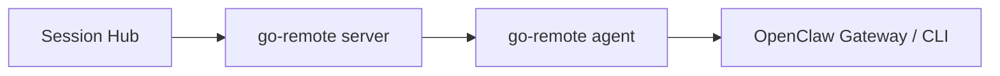

# go-worker 取代现有 Worker 的规划

这份文档只回答一个问题：

> **如果我想让 go-worker 取代现在的 TypeScript Worker 职责，应该怎么做？**

先给最短结论：

> **不要让 go-worker 走 go-remote 现在那套“发 shell 命令”的路子。正确做法是：把 go-worker 做成一个“Hub 原生 Worker”，直接说 Hub 协议，直接调本机 OpenClaw Gateway。**

也就是说，目标不是：

- 用 go-remote server + agent 去“模拟” Worker

而是：

- 用 Go 重写一个真正的 Worker

---

## 1. 先明确这次替代到底在替代什么

当前 Worker 的职责，不是“随便在机器上跑点东西”，而是很具体的 4 件事：

1. **主动连 Session Hub**
2. **接收 Hub 派发的任务**
3. **调用本机 OpenClaw Gateway**
4. **把结构化结果回给 Hub**

这 4 件事在当前实现里都很清楚：

- `src/funclaw/worker/run.ts`
- `src/funclaw/worker/hub-client.ts`
- `src/funclaw/worker/openclaw-client.ts`

所以你要替代的，不是一个“进程名”，而是这一整套职责。

---

## 2. 先说推荐路线

## 2.1 不推荐路线

不推荐这样做：

> 继续沿用 go-remote 现在的思路，让 go-worker 收到任务后去拼 shell 命令，再调用 `openclaw agent ...`

原因很简单：

- 这不是当前 Worker 的职责模型
- 输出会退化成 stdout / stderr
- artifact 很难处理
- `node.invoke` 不自然
- 协议会变粗
- 排错很痛苦

一句话：

> **这会把“结构化 Worker”退化回“远程命令执行器”。**

## 2.2 推荐路线

推荐这样做：

> **把 go-worker 做成一个 Hub-native Worker。**

意思是：

- 直接连 Hub 的 `/ws`
- 直接做 Hub 的 `connect` / `heartbeat` / `task.*` 协议
- 直接调本机 Gateway 的 HTTP / WS
- 直接回传 `result / artifacts / error`

也就是它在架构里的位置，应该还是：


而不是：



后面这条链太绕，不适合替代当前 Worker。

---

## 3. 目标架构应该长什么样

你要的最终状态，建议是这样：

### 保留不动

- `Session Hub` 继续保留
- `OpenClaw Gateway` 继续保留
- Hub 的 HTTP API / WS 协议继续保留

### 替换掉

- 当前 TypeScript Worker 进程

### 新增

- 一个 Go 实现的 `go-worker`

所以系统职责变成：

| 组件 | 角色 |
| --- | --- |
| `Session Hub` | 总调度台 |
| `go-worker` | Hub 原生 Worker，负责接任务、调 Gateway、回结果 |
| `OpenClaw Gateway` | 真正执行者 |

---

## 4. go-worker 必须完整覆盖的能力清单

这是最关键的一段。

如果 go-worker 要取代现有 Worker，它至少必须补齐下面这些能力。

## 4.1 连 Hub 的能力

必须支持：

- WebSocket 连接 Hub
- 收 `connect.challenge`
- 发 `connect`
- 通过 token 鉴权
- 注册自己的 `worker_id`、`hostname`、`version`、`capabilities`
- 定期发 `worker.heartbeat`

当前参考位置：

- `src/funclaw/worker/hub-client.ts`
- `src/funclaw/hub/server.ts:480`
- `src/funclaw/hub/server.ts:525`

### 替代完成标准

go-worker 启动后，`GET /api/v1/workers` 能看到它在线。

---

## 4.2 任务接收能力

必须支持接收 Hub 事件：

- `task.assigned`

并且能识别当前 3 种动作：

- `responses.create`
- `session.history.get`
- `node.invoke`

协议定义位置：

- `src/funclaw/contracts/schema.ts`

### 替代完成标准

Hub 派出去的任务，不再依赖 TypeScript Worker，也能被 go-worker 正常消费。

---

## 4.3 任务状态回传能力

必须支持这些 Hub 方法：

- `task.accepted`
- `task.output`（第一版可以先不流式，但协议位最好留着）
- `task.completed`
- `task.failed`
- `artifact.register`

Hub 当前就是按这几个方法来更新任务生命周期的：

- `src/funclaw/hub/server.ts:577`

### 替代完成标准

Hub 里的 request 生命周期仍然完整：

```text
queued -> running -> completed / failed
```

---

## 4.4 调 Gateway 的能力

go-worker 必须像当前 Worker 一样，直接调 Gateway 3 个面：

### A. responses.create

- `POST /v1/responses`

### B. session.history.get

- `GET /sessions/{sessionKey}/history`

### C. node.invoke

- Gateway WebSocket `node.invoke`

参考位置：

- `src/funclaw/worker/openclaw-client.ts:77`
- `src/funclaw/worker/openclaw-client.ts:95`
- `src/funclaw/worker/openclaw-client.ts:121`

### 替代完成标准

go-worker 不是去跑 shell，而是直连 Gateway API / WS。

---

## 4.5 artifact 能力

如果 `node.invoke` 或其他能力返回：

- base64 图片
- 视频
- 文件

go-worker 必须能：

1. 识别产物
2. 必要时先 `artifact.register`
3. 最终在 `task.completed` 里回传 artifact 描述

当前参考：

- `src/funclaw/worker/run.ts:60`
- `src/funclaw/worker/openclaw-client.ts:134`
- `src/funclaw/hub/server.ts:621`

### 替代完成标准

go-worker 不能只会回文本，必须能回结构化 artifact。

---

## 5. 建议分 5 个阶段做

## 阶段 0：先定边界，不写代码

先拍板下面 3 件事：

### 1）这次替代只替代 Worker，不替代 Hub

也就是说：

- Hub 协议不改
- Hub API 不改
- Hub 存储模型不改

### 2）这次替代只替代 Worker，不替代 Gateway

也就是说：

- OpenClaw Gateway 仍然是执行本体
- go-worker 仍然只做代理层

### 3）这次替代不走 shell 执行模型

也就是说：

- 不再依赖 `openclaw agent --message ...`
- 不把 go-worker 做成一个“命令转发器”

如果这 3 个边界不先定，后面容易越改越歪。

---

## 阶段 1：先做最小可连通版

这一阶段只做：

- go-worker 能连上 Hub
- 能通过鉴权
- 能在 Hub 里显示在线
- 能发 heartbeat
- 能打印收到的 `task.assigned`

这一步的目标不是执行任务，而是：

> **先证明 Go 版 Worker 能成为 Hub 的原生客户端。**

### 验收标准

- 启动 go-worker 后，Hub `/api/v1/workers` 能看到它
- 停掉 go-worker 后，Hub 能把它标记离线

---

## 阶段 2：先只替代 `responses.create`

这是最重要的 MVP。

只做一件事：

- 收到 `responses.create`
- 发 `task.accepted`
- 调 Gateway `/v1/responses`
- 发 `task.completed` / `task.failed`

先不要碰：

- `session.history.get`
- `node.invoke`
- artifact

### 为什么先做这个

因为它是主链路里最常见、最直观的一条。

先把这条跑通，就能验证：

- Hub 协议
- Gateway 调用
- 错误回传
- request 生命周期

### 验收标准

通过 Hub 发一条文本消息，能走完：

```text
queued -> running -> completed
```

并拿到正确文本结果。

---

## 阶段 3：补 `session.history.get`

这一阶段加：

- `GET /sessions/{sessionKey}/history`

这样 go-worker 才算覆盖了当前 Worker 的第二类能力。

### 验收标准

通过 Hub 调历史接口时，go-worker 能代替现有 Worker 返回历史结果。

---

## 阶段 4：补 `node.invoke` 和 artifact

这是最复杂的一阶段。

因为这里不仅要调 Gateway WS，还要处理产物：

- 截图
- 图片
- 视频
- 文件

你需要补齐：

1. Gateway WS 调用器
2. base64 / 文件产物识别
3. artifact.register
4. task.completed 里回传 artifact descriptor

### 验收标准

go-worker 能正确承接至少一种 `node.invoke` 产物场景，比如：

- `canvas.snapshot`

---

## 阶段 5：灰度切流，再完全替换

等前三四阶段都跑稳了，才做替换。

建议顺序：

### 方案 A：并行运行，按 worker_id 灰度

先让：

- TypeScript Worker
- go-worker

同时都能注册到 Hub。

然后通过新 session 只落到指定 go-worker 上做灰度。

### 方案 B：单机替换

在测试 / 预发布环境，直接停掉 TS Worker，只跑 go-worker。

### 最后才做生产替换

生产切换前至少要完成：

- 文本请求回归
- 历史查询回归
- node.invoke 回归
- artifact 回归
- 掉线重连回归

---

## 6. 技术上最值得复用什么，最不值得复用什么

## 6.1 可以复用的思路

如果 go-worker 要基于 go-remote 演进，可以复用这些“通用能力”：

- WebSocket 连接管理
- 重连机制
- 心跳发送
- 基础日志
- 配置加载

这些属于“通信底座”，有复用价值。

## 6.2 不建议复用的核心模型

不建议直接复用 go-remote 当前这些核心抽象：

- `exec`
- `result`
- “下发 shell 命令”
- “stdout/stderr 作为业务结果”

因为这些和当前 Worker 要做的事不是一个层级。

一句话：

> **可以借 go-remote 的壳，但不要继承它的命令执行脑子。**

---

## 7. 替代过程中最大的风险点

## 风险 1：做成了“命令执行器”，不是“Hub Worker”

这是最大风险。

如果 go-worker 最后还是：

- 收一个任务
- 拼 shell
- 跑 `openclaw agent`

那其实没有真正替代当前 Worker。

它只是换了个语言继续做桥接脚本。

## 风险 2：只支持文本，不支持 artifact

如果只做文本，你会误以为已经替代成功。

但实际上：

- `node.invoke`
- 图片 / 视频 / 文件

这条能力链还是断的。

## 风险 3：不保留结构化生命周期

如果没有：

- accepted
- completed
- failed
- artifact.register

Hub 这一侧的 request 状态就会退化。

那就不是“替代”，而是“降级”。

## 风险 4：把 session sticky 逻辑搬错位置

session sticky 现在属于 Hub，不属于 Worker。

所以 go-worker 替代时不要乱加：

- 自己重新做会话调度
- 自己决定 session 应该去哪台机器

这会破坏 Hub 的职责边界。

---

## 8. 我建议的代码落地方式

如果现在就开工，我建议新建一个独立 Go 子项目，名字可以很直接，比如：

```text
go-worker/
```

内部建议拆成这几层：

### 1）hubclient

负责：

- 连接 Hub
- 鉴权
- 握手
- heartbeat
- task.* 回传

### 2）gatewayclient

负责：

- `/v1/responses`
- `/sessions/{sessionKey}/history`
- `node.invoke`

### 3）runner / dispatcher

负责：

- 收到 `task.assigned`
- 根据 action 调不同执行器
- 把结果包装成 Hub 需要的结构

### 4）artifact

负责：

- 识别产物
- 组装 artifact descriptor
- 调 `artifact.register`

### 5）cmd/go-worker

负责：

- 配置加载
- 启动主循环

---

## 9. 建议的最小里程碑

如果你想按最短路径推进，我建议就用下面这 4 个里程碑：

### 里程碑 1

go-worker 成功注册到 Hub，并保持心跳

### 里程碑 2

go-worker 成功替代 `responses.create`

### 里程碑 3

go-worker 成功替代 `session.history.get`

### 里程碑 4

go-worker 成功替代 `node.invoke + artifact`

做到第 4 个里程碑，才能说：

> **go-worker 基本完成了对当前 Worker 的职责替代。**

---

## 10. 最后给一个明确建议

如果你让我直接拍板，我的建议是：

> **让 go-worker 取代现有 Worker 是可以做的，但必须按“Hub 原生 Worker”来做，不要按“go-remote 命令执行器”来做。**

换句话说：

- **可以复用 go-remote 的通信底座**
- **不要复用 go-remote 的命令执行模型**

---

## 11. 一句话总结

一句话收口：

> **要替代当前 Worker，go-worker 必须学会“连 Hub、懂任务、调 Gateway、回结构化结果”，而不是“收命令、跑 shell、回 stdout”。**
