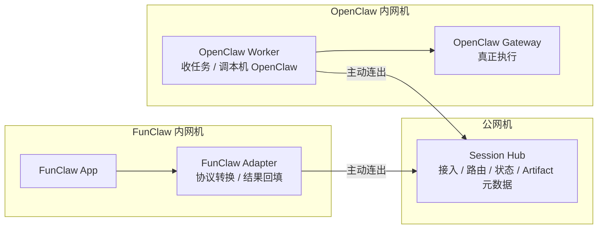
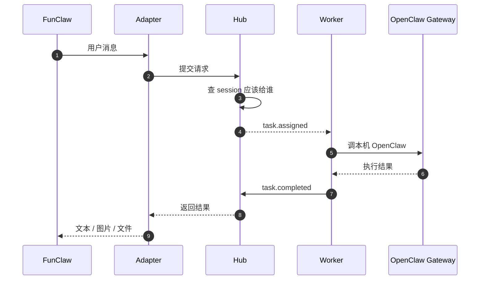

# FunClaw / OpenClaw Session Hub 方案（精简版）

## 1. 先看结论

这套设计可以一句话理解成：

> `FunClaw` 不再直接连 `OpenClaw`，而是统一把请求交给一个公网 `Session Hub`，再由 `Hub` 把请求转给正确的 `OpenClaw Worker`。

最重要的边界只有一句：

> **Hub 负责接入和转发，不负责真正执行。真正干活的还是 OpenClaw。**

---

## 2. 这个方案到底在解决什么问题

当前环境里有 3 个现实约束：

- `OpenClaw` 在内网，外面打不进去
- `FunClaw` 也在内网，外面也打不进去
- 但它们都可以主动往外连

所以最自然的做法不是“外部直接访问内网机器”，而是：

- `OpenClaw Worker` 主动连 `Hub`
- `FunClaw Adapter` 主动连 `Hub`
- 所有请求都先到 `Hub`

这样做的好处很直接：

- `FunClaw` 不用记每台 `OpenClaw` 的地址
- 内网机器不用直接暴露业务端口
- 后面要扩成多台 `OpenClaw` 也更顺

---

## 3. 用人话理解 3 个核心角色

| 角色 | 你可以把它理解成什么 | 它负责什么 |
| --- | --- | --- |
| `FunClaw Adapter` | `FunClaw` 身边的翻译和跑腿 | 把 FunClaw 的消息转成 Hub 能懂的格式，再把结果带回来 |
| `Session Hub` | 总调度台 | 接住请求、鉴权、记住会话在哪台 Worker、转发结果 |
| `OpenClaw Worker` | `OpenClaw` 身边的执行代理 | 收任务、调用本机 OpenClaw Gateway、把执行结果回传 |

再强调一次：

- **Hub 不执行 Agent**
- **Worker 也不是 Agent 本体**
- **真正执行的是本机的 `OpenClaw Gateway`**

---

## 4. 整体结构图



---

## 5. 一条消息是怎么走的

你可以把一次请求理解成下面 8 步：

1. 用户在 `FunClaw` 发消息
2. `FunClaw Adapter` 接住这条消息
3. Adapter 把消息发给 `Session Hub`
4. `Hub` 看这条会话应该落到哪台 `Worker`
5. `Hub` 把任务派给那台 `Worker`
6. `Worker` 去调用本机 `OpenClaw Gateway`
7. `OpenClaw` 执行完，把结果返回给 `Worker`
8. `Worker -> Hub -> Adapter -> FunClaw`，结果一路传回去

对应图如下：



---

## 6. 这套方案最关键的设计点

### 6.1 会话要有“粘性”

这是整套方案最关键的点。

意思是：

> 同一个 `session_id`，第一次分给哪台 `Worker`，后面最好都继续分给它。

原因很简单：

- 上下文在那台机器上
- 历史记录在那台机器上
- 临时文件和缓存也在那台机器上

所以 `Hub` 必须记住一张表：

```text
session_id -> worker_id
```

如果没有这张表，整个系统会很容易乱掉。

### 6.2 Hub 要轻，不要变成第二个 OpenClaw

Hub 应该做的是：

- 接入
- 鉴权
- 路由
- 请求状态记录
- 结果转发

Hub 不应该做的是：

- 自己执行 Agent
- 自己保存完整对话上下文
- 自己重做 OpenClaw 的能力

否则最后会演变成：

> 明明是一个转发层，结果膨胀成一个新的主系统。

### 6.3 文件产物不要全塞进内存

第一版策略很简单：

- 小文件：可以直接内联返回
- 大文件：Hub 落盘，或者未来放对象存储

当前文档里的规则是：

```text
<= 1MB：inline
> 1MB：hub_file
```

---

## 7. 现在这套设计里，谁负责什么

### Hub 负责

- 对外暴露 HTTP / WS 入口
- 维护在线 Worker 列表
- 维护 `session_id -> worker_id`
- 维护请求状态
- 维护 artifact 元数据和下载入口

### Worker 负责

- 主动连 Hub
- 接任务
- 调本机 OpenClaw 的 3 个入口
  - `POST /v1/responses`
  - `GET /sessions/{sessionKey}/history`
  - `WS node.invoke`
- 回传结果和产物

### Adapter 负责

- 给 `FunClaw` 提供本地统一入口
- 把 `FunClaw` 的消息转换成 Hub 协议
- 把 Hub 返回的结果还原成 `FunClaw` 能消费的形式

---

## 8. MVP 第一版到底做什么

### 做

- 1 个 `Hub`
- 1 个 `Worker`
- 1 套 `Adapter` 协议
- 3 个核心动作：
  - `responses.create`
  - `session.history.get`
  - `node.invoke`
- 会话粘性
- 两种产物传输方式：
  - `inline`
  - `hub_file`

### 先不做

- 多 Worker 自动迁移
- 多租户隔离
- 对象存储
- TLS / WSS
- 复杂限流
- Adapter 正式实现代码

换句话说，第一版目标不是“做成完美平台”，而是：

> **先把链路跑通，并且保证结构是对的。**

---

## 9. 部署上怎么放

### 公网机

跑一个：

- `funclaw-hub.service`

它负责：

- 对外开放 `:31880`
- 提供 HTTP API 和 `/ws`
- 保存 `sessions.json`
- 保存 `requests.jsonl`
- 保存 `artifacts.json` 和 `artifacts/`

### OpenClaw 机器

至少有两个角色：

- `OpenClaw Gateway`：真正执行
- `funclaw-openclaw-worker.service`：连 Hub、收任务、代调用 Gateway

### FunClaw 机器

未来放一个 sidecar：

- `FunClaw Adapter`

也就是：

```text
FunClaw App -> Adapter -> Hub -> Worker -> OpenClaw Gateway
```

---

## 10. 当前现网的特别说明

文档里还有一个很重要的现网结论：

> 当前主 Gateway 的配置可能被别的流程改写，所以 FunClaw MVP 最终用了一个“专用 Gateway”。

当前实际链路更像这样：

```text
FunClaw Hub
  -> OpenClaw Worker
  -> 专用 OpenClaw Gateway
  -> 127.0.0.1:18790
```

这样做的目的只有一个：

> 不污染现网原来的 OpenClaw 主链路，先把 FunClaw 这条链路单独跑稳。

---

## 11. 如果你只记 5 句话，记这 5 句就够了

1. `FunClaw` 不直接连 `OpenClaw`，统一连 `Hub`
2. `Hub` 只做接入和转发，不做执行
3. `Worker` 是 `OpenClaw` 前面的执行代理
4. 真正执行永远在本机 `OpenClaw Gateway`
5. 整个系统能不能稳定，关键看 `session_id -> worker_id` 这张映射表

---

## 12. 想继续看细节时看哪里

如果已经看懂整体，再往下钻可以看这些文件：

- 完整设计稿：`Funclaw/实现方案2-session-hub版.md`
- Hub HTTP 协议：`Funclaw/funclaw-hub.openapi.yaml`
- Hub 入口实现：`src/funclaw/hub/server.ts`
- Hub 状态存储：`src/funclaw/hub/store.ts`
- Worker 主流程：`src/funclaw/worker/run.ts`
- Worker 连 Hub：`src/funclaw/worker/hub-client.ts`
- Worker 调 OpenClaw：`src/funclaw/worker/openclaw-client.ts`
- CLI 入口：`src/cli/funclaw-cli/register.ts`
