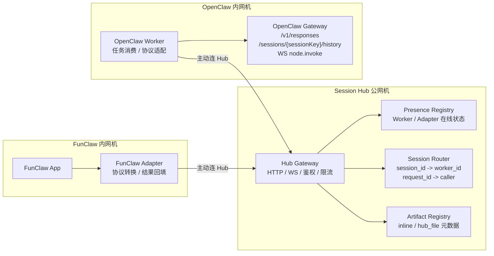
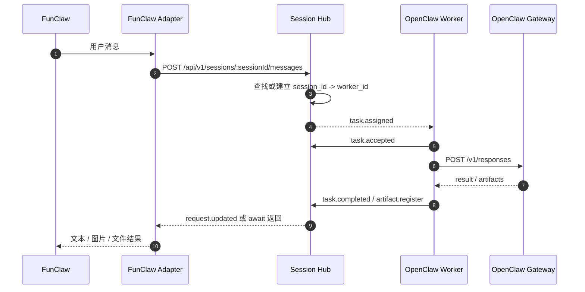
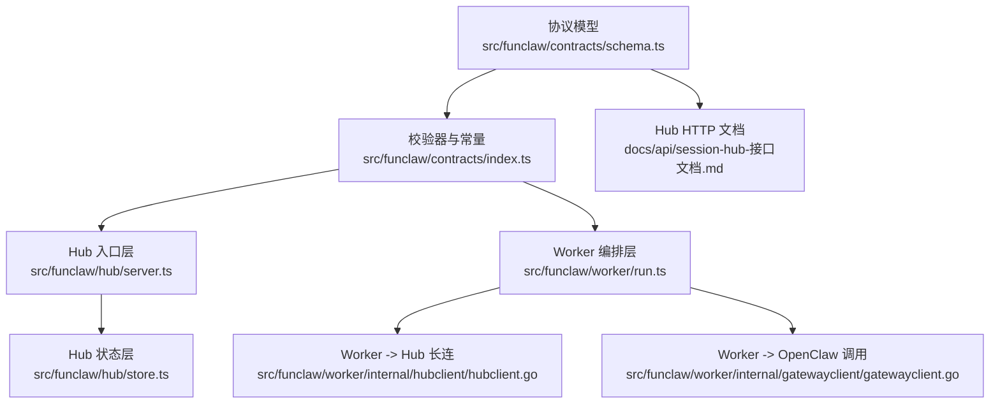
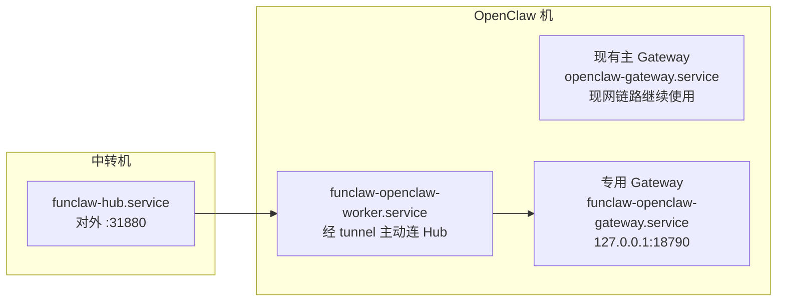

# FunClaw / OpenClaw Session Hub 方案
## 0. 架构速览

先看一句人话版：

> `FunClaw` 不再直接找每台 `OpenClaw`，而是统一把请求交给 `Session Hub`；`Hub` 只负责接入、分发、记住会话落在哪台 Worker，不负责真正执行 Agent。

### 0.1 三个核心角色

| 角色 | 放哪 | 主要职责 | 不做什么 |
| --- | --- | --- | --- |
| `FunClaw Adapter` | `FunClaw` 内网机 | 接住 `FunClaw` 消息，转成 Hub 协议，等结果，再回填给 `FunClaw` | 不直接调用每台 `OpenClaw` |
| `Session Hub` | 唯一公网机 | 统一入口、鉴权、长连管理、`session_id -> worker_id` 路由、请求状态、artifact 元数据 | 不执行 Agent，不保存完整 OpenClaw 内部状态 |
| `OpenClaw Worker` | `OpenClaw` 内网机 | 主动连 Hub、消费任务、调用本机 `OpenClaw Gateway`、回传结果 | 不直接暴露公网入口 |

### 0.2 逻辑架构图



### 0.3 核心链路时序图



### 0.4 代码和协议怎么对应



### 0.5 架构拆面理解

可以把整套系统拆成 4 个面来看：

1. **接入面**：Hub 的 HTTP/WS 入口，负责鉴权、升级、限流、接住 Adapter / Worker。
2. **路由面**：`session_id -> worker_id` 和 `request_id -> caller`，负责把同一会话稳定打到同一台 Worker。
3. **执行面**：真正执行永远发生在 `OpenClaw Gateway`，Worker 只是代调用。
4. **产物面**：小文件内联，大文件走 `hub_file` 或未来对象存储，Hub 只保元数据和下载入口。

## 1. 适用场景
这份方案适用于下面这个前提：
- **只有一台有公网 IP 的服务器**
- `OpenClaw` 部署在内网服务器，没有公网 IP，但**能主动出网**
- `FunClaw` 部署在另一台内网服务器，也没有公网 IP，但**能主动出网**
- 希望 `FunClaw` 不直接对接每一台 `OpenClaw`
- 希望后面可以扩展到多台 `OpenClaw`
这份方案的核心思想是：
> 在唯一一台公网服务器上部署一个 **Session Hub**，让 `OpenClaw` 和 `FunClaw` 都主动连到它，所有业务流量都通过 Hub 调度。
---
## 2. 一句话结论
这个方案**有可行性**，而且比“纯 SSH 端口转发”更像一套正式系统。
但要注意一个边界：
> **Session Hub 只做接入、路由、状态登记和结果转发，不要做成第二个 OpenClaw。**
也就是说：
- `OpenClaw` 仍然负责真正执行
- `Hub` 只负责找到该把请求发给哪台 `OpenClaw`
- `FunClaw` 只需要连 `Hub`
---
## 3. 这套方案为什么适合你们当前环境
你们当前最重要的现实条件不是“有没有 SSH”，而是：
- `OpenClaw` 机器**不能被外部直接访问**
- `FunClaw` 机器**也不能被外部直接访问**
- 但两边都能**主动向外连**
这意味着最自然的网络模型不是“外面连进去”，而是：
- `OpenClaw -> Session Hub` 主动长连
- `FunClaw -> Session Hub` 主动长连
这样可以避免：
- 在内网机器上暴露业务端口
- 为每台机器维护反向 SSH 映射
- 让 `FunClaw` 记住每台 `OpenClaw` 的地址
---
## 4. 推荐架构
## 4.1 角色划分
### A. Session Hub 公网服务器
职责：
- 提供唯一公网入口
- 接受 `OpenClaw Worker` 的主动注册和长连接
- 接受 `FunClaw Adapter` 的主动注册和长连接
- 维护 `session -> worker` 的映射关系
- 转发请求、转发结果、管理在线状态
- 提供日志、鉴权、限流、健康检查
### B. OpenClaw Worker
部署在 `OpenClaw` 所在服务器上。
职责：
- 本地访问 `OpenClaw Gateway`
- 主动连到 `Session Hub`
- 接收 Hub 下发的任务
- 调用本机 `OpenClaw`
- 把文本、状态、图片、文件元数据结果回传给 Hub
### C. FunClaw Adapter
部署在 `FunClaw` 所在服务器上。
职责：
- 主动连到 `Session Hub`
- 把 `FunClaw` 侧的会话消息交给 Hub
- 等待结果
- 把结果再交还给 `FunClaw`
---
## 4.2 网络拓扑
```text
                 ┌──────────────────────────┐
                 │  Session Hub 公网服务器   │
                 │                          │
                 │  - Hub API               │
                 │  - Hub WS                │
                 │  - Session Router        │
                 │  - Presence Registry     │
                 │  - Artifact Metadata     │
                 └──────────┬───────────────┘
                            ▲
                主动长连     │      主动长连
                            │
          ┌─────────────────┘─────────────────┐
          │                                   │
┌─────────┴─────────┐               ┌─────────┴─────────┐
│ OpenClaw 内网机    │               │ FunClaw 内网机     │
│                   │               │                   │
│ OpenClaw Gateway  │               │ FunClaw Adapter   │
│ OpenClaw Worker   │               │ FunClaw App       │
│ 127.0.0.1:18789   │               │                   │
└───────────────────┘               └───────────────────┘
```
---
## 5. 整体设计原则
## 5.1 Hub 做轻，不做重
Hub 要做的是：
- 注册
- 路由
- 状态管理
- 结果转发
- 鉴权
- 观测
Hub 不要做的是：
- 不要自己执行 Agent
- 不要自己维护 OpenClaw 的完整内部状态
- 不要把 OpenClaw 的能力重新实现一遍
- 不要把大文件正文长期存在 Hub 进程内存里
否则 Hub 会失控，最终变成“再造一个 OpenClaw 外壳”。
## 5.2 会话必须有粘性
一条会话第一次进入哪台 `OpenClaw Worker`，后续最好继续落到同一台。
因为 `OpenClaw` 的很多状态天然在本机：
- Session 上下文
- 会话历史
- 临时文件
- 媒体缓存
- 本地工具状态
所以 Hub 必须维护最基本的映射：
```text
session_id -> worker_id
```
这就是整个方案能稳定工作的关键。
## 5.3 大文件不要默认全走 Hub 内存
建议：
- **小图片 / 小文件**：可直接经 Hub 转发
- **大文件 / 视频 / 大图**：走对象存储或临时文件服务
也就是：
1. `OpenClaw Worker` 先把产物上传到对象存储
2. 回给 Hub 一个 `artifact_id` 或下载 URL
3. Hub 再把元数据转给 `FunClaw`
这样更稳。
---
## 6. 推荐的组件结构
## 6.1 Hub 侧组件
建议拆成 4 个逻辑模块：
### 1）Hub Gateway
提供：
- `HTTPS API`
- `WebSocket`
功能：
- 鉴权
- 接入控制
- 连接升级
- 限流
### 2）Presence Registry
维护：
- 哪些 `OpenClaw Worker` 在线
- 哪些 `FunClaw Adapter` 在线
- 每台机器的能力、版本、租户、环境信息
### 3）Session Router
维护：
- `session_id -> worker_id`
- `request_id -> caller`
- 路由策略
### 4）Artifact Registry
维护：
- 小文件内联返回
- 大文件 URL / 对象存储信息
- 过期时间
- 下载授权
---
## 6.2 OpenClaw 侧组件
建议部署两个进程：
### 1）OpenClaw Gateway
职责不变：
- 本地运行 Agent
- 提供 `/v1/responses`
- 提供 `/v1/chat/completions`
- 提供 session/history
- 提供 WebSocket 控制面
要求：
- `gateway.bind=loopback`
- 只监听 `127.0.0.1:18789`
### 2）OpenClaw Worker
这是 Hub 方案新增的轻量服务。
职责：
- 主动连 Hub
- 接收 Hub 下发请求
- 调用本机 `OpenClaw`
- 把结果回传 Hub
它相当于 `OpenClaw` 的“远程代理”。
---
## 6.3 FunClaw 侧组件
建议部署一个 `FunClaw Adapter`。
职责：
- 把 `FunClaw` 的消息转成 Hub 能识别的格式
- 向 Hub 发起 `start_session / send_message / await_result / fetch_artifact`
- 把 Hub 返回结果回给 `FunClaw`
这样 `FunClaw` 不需要理解 `OpenClaw` 的内部接口细节。
---
## 7. 推荐的消息流
## 7.1 文本消息流
```text
FunClaw
  -> FunClaw Adapter
  -> Session Hub
  -> 选中 OpenClaw Worker
  -> Worker 调本机 OpenClaw /v1/responses
  -> Worker 拿到文本结果
  -> 回传 Hub
  -> Hub 回传 FunClaw Adapter
  -> FunClaw
```
## 7.2 会话粘性流
第一次：
```text
session_123 不存在
  -> Hub 挑一台可用 Worker
  -> 记录 session_123 -> worker_A
```
后续：
```text
session_123 已存在
  -> Hub 直接把请求发给 worker_A
```
## 7.3 图片/文件输入流
```text
FunClaw
  -> Adapter
  -> Hub
  -> Worker
  -> Worker 调本机 OpenClaw /v1/responses
       携带 input_image / input_file
  -> OpenClaw 执行
  -> 文本结果回传
```
## 7.4 图片/截图/视频产出流
适合走能力调用：
```text
FunClaw
  -> Adapter
  -> Hub
  -> Worker
  -> Worker 调本机 OpenClaw WS / node.invoke
       canvas.snapshot / camera.snap / screen.record
  -> Worker 得到 base64 / 文件信息
  -> 小结果直接回 Hub
  -> 大结果上传对象存储后回 Hub 元数据
  -> Adapter 再回给 FunClaw
```
---
## 8. 可开发的接口设计稿
下面这一段开始，不再只是“思路描述”，而是直接按 **MVP 可开发接口** 写死。

## 8.1 OpenClaw 调用面固定
Worker 调 OpenClaw 只走 3 个面：

### A. `POST /v1/responses`
用途：
- 文本对话
- 图片 / 文件输入
- 默认主执行入口

### B. `GET /sessions/{sessionKey}/history`
用途：
- 拉会话历史
- 失败补偿
- 审计 / 回放

### C. Gateway WebSocket `node.invoke`
用途：
- `canvas.snapshot`
- `camera.snap`
- `camera.clip`
- 其他 node 能力

第一版不让 Hub 直接调用 OpenClaw。
**必须由 Worker 调本机 OpenClaw，再把结果回给 Hub。**

---
## 8.2 Hub HTTP API 列表
Hub 对外只开一个 HTTP 入口，默认端口：

```text
31880
```

为了方便多人协作，当前仓库把 HTTP 接口说明集中放在这份文档：

```text
docs/api/session-hub-接口文档.md
```

如果后续补机器可读版本，建议新增到：

```text
docs/api/funclaw-hub.openapi.yaml
```

默认公开路径如下：

### 1）健康检查
#### `GET /healthz`

返回：

```json
{
  "ok": true,
  "status": "live"
}
```

#### `GET /readyz`
语义：
- Hub 进程活着，但没有 Worker 在线：`503`
- 至少有 1 台 Worker 在线：`200`

示例：

```json
{
  "ok": true,
  "status": "ready",
  "workers_online": 1
}
```

### 2）查询 Worker
#### `GET /api/v1/workers`

用途：
- 看当前哪些 Worker 在线
- 调试 Hub 路由状态

返回：

```json
{
  "ok": true,
  "workers": [
    {
      "workerId": "openclaw-main-1",
      "hostname": "arkclaw",
      "version": "1.0.0",
      "capabilities": [
        "responses.create",
        "session.history.get",
        "node.invoke"
      ],
      "connectedAt": "2026-04-15T08:00:00.000Z",
      "lastHeartbeatAt": "2026-04-15T08:00:10.000Z"
    }
  ]
}
```

### 3）声明 / 创建会话
#### `POST /api/v1/sessions`

请求体：

```json
{
  "session_id": "conversation-123",
  "adapter_id": "funclaw-sidecar-a",
  "openclaw_session_key": "funclaw:conversation-123"
}
```

语义：
- 如果 `session_id` 不存在：选一台在线 Worker 并建立粘性绑定
- 如果已存在：直接返回既有绑定

返回：

```json
{
  "ok": true,
  "session": {
    "session_id": "conversation-123",
    "worker_id": "openclaw-main-1",
    "adapter_id": "funclaw-sidecar-a",
    "openclaw_session_key": "funclaw:conversation-123",
    "status": "bound",
    "created_at": "2026-04-15T08:00:00.000Z",
    "last_seen_at": "2026-04-15T08:00:00.000Z"
  }
}
```

### 4）提交消息 / 任务
#### `POST /api/v1/sessions/:sessionId/messages`

请求体：

```json
{
  "request_id": "optional-client-idempotency-key",
  "adapter_id": "funclaw-sidecar-a",
  "openclaw_session_key": "funclaw:conversation-123",
  "action": "responses.create",
  "input": {
    "model": "openclaw",
    "input": "你好"
  }
}
```

`action` 第一版只支持 3 个值：
- `responses.create`
- `session.history.get`
- `node.invoke`

返回：

```json
{
  "ok": true,
  "request": {
    "request_id": "req_123",
    "session_id": "conversation-123",
    "worker_id": "openclaw-main-1",
    "adapter_id": "funclaw-sidecar-a",
    "openclaw_session_key": "funclaw:conversation-123",
    "action": "responses.create",
    "input": {
      "model": "openclaw",
      "input": "你好"
    },
    "status": "queued",
    "created_at": "2026-04-15T08:00:00.000Z",
    "updated_at": "2026-04-15T08:00:00.000Z",
    "outputs": [],
    "artifacts": []
  }
}
```

### 5）查请求状态
#### `GET /api/v1/requests/:requestId`

返回完整 `RequestRecord`。

### 6）等待请求完成
#### `POST /api/v1/requests/:requestId/await`

请求体：

```json
{
  "timeout_ms": 30000
}
```

返回规则：
- 已完成：`200`
- 还没完成但超时：`202`
- 不存在：`404`

### 7）拉历史
#### `GET /api/v1/sessions/:sessionId/history`

语义：
- Hub 内部转成一次 `session.history.get` 任务
- 由 Worker 调本机 OpenClaw `GET /sessions/{sessionKey}/history`
- Hub 等结果后直接回 HTTP

### 8）查 artifact 元数据
#### `GET /api/v1/artifacts/:artifactId`

返回：

```json
{
  "ok": true,
  "artifact": {
    "artifact_id": "art_123",
    "kind": "image",
    "filename": "snapshot.jpg",
    "mime_type": "image/jpeg",
    "size_bytes": 123456,
    "sha256": "....",
    "transport": "hub_file",
    "download_url": "http://47.118.27.59:31880/api/v1/artifacts/art_123/content",
    "expires_at": "2026-04-16T08:00:00.000Z",
    "meta": {
      "format": "jpg"
    }
  }
}
```

### 9）取 artifact 内容
#### `GET /api/v1/artifacts/:artifactId/content`

返回二进制正文。

---
## 8.3 Hub WS 消息格式
Hub WS 复用 OpenClaw Gateway 的顶层帧风格：

### 请求帧

```json
{
  "type": "req",
  "id": "req-1",
  "method": "connect",
  "params": {}
}
```

### 响应帧

```json
{
  "type": "res",
  "id": "req-1",
  "ok": true,
  "payload": {}
}
```

### 事件帧

```json
{
  "type": "event",
  "event": "task.assigned",
  "payload": {},
  "seq": 12
}
```

---
## 8.4 WS 握手
连接建立后，Hub 先发挑战：

```json
{
  "type": "event",
  "event": "connect.challenge",
  "payload": {
    "nonce": "7b27c9...",
    "ts": 1776240000000
  },
  "seq": 1
}
```

Worker 再发：

```json
{
  "type": "req",
  "id": "connect-1",
  "method": "connect",
  "params": {
    "minProtocol": 1,
    "maxProtocol": 1,
    "client": {
      "id": "funclaw-worker",
      "version": "1.0.0",
      "platform": "linux",
      "mode": "worker"
    },
    "role": "worker",
    "auth": {
      "token": "HUB_TOKEN"
    },
    "nonce": "7b27c9...",
    "worker": {
      "worker_id": "openclaw-main-1",
      "hostname": "arkclaw",
      "version": "1.0.0",
      "capabilities": [
        "responses.create",
        "session.history.get",
        "node.invoke"
      ]
    }
  }
}
```

Hub 返回：

```json
{
  "type": "res",
  "id": "connect-1",
  "ok": true,
  "payload": {
    "type": "hello-ok",
    "protocol": 1,
    "server": {
      "version": "OpenClaw-version",
      "connId": "conn-123"
    },
    "policy": {
      "heartbeatIntervalMs": 15000,
      "maxInlineArtifactBytes": 1048576
    },
    "features": {
      "methods": [
        "connect",
        "worker.heartbeat",
        "task.accepted",
        "task.output",
        "task.completed",
        "task.failed",
        "artifact.register"
      ],
      "events": [
        "connect.challenge",
        "task.assigned",
        "task.cancel"
      ]
    }
  }
}
```

Adapter 如果以后走 WS，也用同样的握手，只是：

```json
{
  "role": "adapter",
  "adapter": {
    "adapter_id": "funclaw-sidecar-a",
    "version": "1.0.0"
  }
}
```

---
## 8.5 Worker -> Hub 方法
### `worker.heartbeat`

```json
{
  "type": "req",
  "id": "hb-1",
  "method": "worker.heartbeat",
  "params": {
    "worker_id": "openclaw-main-1",
    "ts": "2026-04-15T08:00:10.000Z"
  }
}
```

### `task.accepted`

```json
{
  "type": "req",
  "id": "accepted-1",
  "method": "task.accepted",
  "params": {
    "request_id": "req_123",
    "accepted_at": "2026-04-15T08:00:01.000Z"
  }
}
```

### `task.output`
第一版不要求必须流式，但协议位预留：

```json
{
  "type": "req",
  "id": "output-1",
  "method": "task.output",
  "params": {
    "request_id": "req_123",
    "output_index": 0,
    "output": {
      "kind": "log",
      "text": "worker started OpenClaw request"
    },
    "emitted_at": "2026-04-15T08:00:02.000Z"
  }
}
```

### `artifact.register`
当 Worker 发现产物太大，不适合继续塞在 `task.completed` 里，就先注册：

```json
{
  "type": "req",
  "id": "artifact-1",
  "method": "artifact.register",
  "params": {
    "request_id": "req_123",
    "artifact": {
      "kind": "image",
      "filename": "snapshot.jpg",
      "mime_type": "image/jpeg",
      "content_base64": "....",
      "meta": {
        "format": "jpg"
      }
    }
  }
}
```

Hub 返回标准 `ArtifactDescriptor`。

### `task.completed`

```json
{
  "type": "req",
  "id": "completed-1",
  "method": "task.completed",
  "params": {
    "request_id": "req_123",
    "completed_at": "2026-04-15T08:00:08.000Z",
    "result": {
      "output_text": "你好，我已经处理完成"
    },
    "artifacts": [
      {
        "artifact_id": "art_123",
        "kind": "image",
        "filename": "snapshot.jpg",
        "mime_type": "image/jpeg",
        "size_bytes": 123456,
        "sha256": "....",
        "transport": "hub_file",
        "download_url": "http://47.118.27.59:31880/api/v1/artifacts/art_123/content",
        "expires_at": "2026-04-16T08:00:00.000Z"
      }
    ]
  }
}
```

### `task.failed`

```json
{
  "type": "req",
  "id": "failed-1",
  "method": "task.failed",
  "params": {
    "request_id": "req_123",
    "failed_at": "2026-04-15T08:00:08.000Z",
    "error": {
      "code": "WORKER_ERROR",
      "message": "OpenClaw /v1/responses failed: 502 ..."
    }
  }
}
```

---
## 8.6 Hub -> Worker 事件
### `task.assigned`

```json
{
  "type": "event",
  "event": "task.assigned",
  "seq": 5,
  "payload": {
    "request_id": "req_123",
    "session_id": "conversation-123",
    "worker_id": "openclaw-main-1",
    "adapter_id": "funclaw-sidecar-a",
    "openclaw_session_key": "funclaw:conversation-123",
    "action": "responses.create",
    "input": {
      "model": "openclaw",
      "input": "你好"
    },
    "created_at": "2026-04-15T08:00:00.000Z"
  }
}
```

### `task.cancel`
第一版先留协议，不强制实现取消链路：

```json
{
  "type": "event",
  "event": "task.cancel",
  "seq": 6,
  "payload": {
    "request_id": "req_123",
    "reason": "client canceled"
  }
}
```

---
## 8.7 `session_id -> worker_id` 数据结构
Hub 侧文件：

```text
sessions.json
```

结构：

```json
{
  "conversation-123": {
    "session_id": "conversation-123",
    "worker_id": "openclaw-main-1",
    "adapter_id": "funclaw-sidecar-a",
    "openclaw_session_key": "funclaw:conversation-123",
    "status": "bound",
    "created_at": "2026-04-15T08:00:00.000Z",
    "last_seen_at": "2026-04-15T08:10:00.000Z",
    "last_request_id": "req_456"
  }
}
```

字段语义：
- `session_id`：FunClaw 侧逻辑会话 ID
- `worker_id`：该会话当前粘到哪台 Worker
- `adapter_id`：是谁把这个会话接进来的
- `openclaw_session_key`：传给 OpenClaw 的真实 sessionKey
- `status`：
  - `bound`
  - `worker_offline`
- `last_request_id`：最后一次落到这个 session 的请求

路由规则固定：
- 第一次建会话：选当前唯一在线 Worker
- 后续消息：严格按 `session_id -> worker_id` 命中
- Worker 掉线：不自动迁移，保留映射并显式失败

---
## 8.8 `RequestRecord` 数据结构
Hub 侧生命周期日志文件：

```text
requests.jsonl
```

每一行都是当前请求的一次快照，Hub 重启后按最后一条恢复。

结构：

```json
{
  "request_id": "req_123",
  "session_id": "conversation-123",
  "worker_id": "openclaw-main-1",
  "adapter_id": "funclaw-sidecar-a",
  "openclaw_session_key": "funclaw:conversation-123",
  "action": "responses.create",
  "input": {
    "model": "openclaw",
    "input": "你好"
  },
  "status": "completed",
  "created_at": "2026-04-15T08:00:00.000Z",
  "updated_at": "2026-04-15T08:00:08.000Z",
  "accepted_at": "2026-04-15T08:00:01.000Z",
  "finished_at": "2026-04-15T08:00:08.000Z",
  "outputs": [],
  "result": {
    "output_text": "你好，我已经处理完成"
  },
  "artifacts": [],
  "error": null
}
```

`status` 第一版只用：
- `queued`
- `running`
- `completed`
- `failed`
- `canceled`

---
## 8.9 artifact 返回格式
artifact 元数据索引文件：

```text
artifacts.json
```

大文件正文目录：

```text
artifacts/
```

标准结构：

```json
{
  "artifact_id": "art_123",
  "kind": "image",
  "filename": "snapshot.jpg",
  "mime_type": "image/jpeg",
  "size_bytes": 123456,
  "sha256": "....",
  "transport": "hub_file",
  "inline_base64": null,
  "download_url": "http://47.118.27.59:31880/api/v1/artifacts/art_123/content",
  "expires_at": "2026-04-16T08:00:00.000Z",
  "meta": {
    "format": "jpg"
  }
}
```

`transport` 第一版只落 2 个值：
- `inline`
- `hub_file`

保留未来值，但不实现：
- `object_store`

### 第一版大小策略

```text
MAX_INLINE_ARTIFACT_BYTES = 1048576
```

规则：
- `<= 1MB`：Hub 内联保存到 `inline_base64`
- `> 1MB`：Hub 落盘到 `artifacts/`，返回 `download_url`

---
## 9. 可部署的服务拆分

## 9.1 Hub 跑哪些进程
阿里云中转机这次只跑一个新增业务进程：

### `funclaw-hub.service`
职责：
- 对外暴露 `:31880`
- 提供 HTTP API
- 提供 `/ws`
- 维护 `sessions.json`
- 维护 `requests.jsonl`
- 维护 `artifacts.json` 和 `artifacts/`

中转机上原有进程继续保留：
- `sshd`
- 现有反向 SSH 映射承接逻辑

这次不在中转机上跑 Docker，因为实测：
- **阿里云中转机没有 Docker / Compose**
- 所以现网最短路径就是 **systemd**

---
## 9.2 Worker 跑哪些进程
OpenClaw 机器上最终跑 3 个东西：

### 1）现有 `openclaw-gateway`
职责：
- 真正执行 OpenClaw
- 监听：

```text
127.0.0.1:18789
```

### 2）现有 `openclaw-relay.service`
职责：
- 把 OpenClaw 机器反向挂到中转机
- 作为回滚和运维兜底

### 3）新增 `funclaw-openclaw-worker.service`
职责：
- 主动连 Hub `ws://47.118.27.59:31880/ws`
- 收 `task.assigned`
- 调本机 `127.0.0.1:18789`
- 把结果回给 Hub

---
## 9.3 Adapter 怎么接 FunClaw
第一版 Adapter 不落地代码，但接口固定成 **独立 sidecar**。

### FunClaw 不直接连 Hub
FunClaw 只调本地 Adapter：

```text
FunClaw App -> localhost Adapter -> Hub
```

### Adapter 本地 API 固定
#### `POST /local/v1/conversations/:conversationId/messages`

请求：

```json
{
  "message_id": "msg_123",
  "input": {
    "action": "responses.create",
    "payload": {
      "model": "openclaw",
      "input": "你好"
    }
  }
}
```

#### `GET /local/v1/requests/:requestId`
#### `POST /local/v1/requests/:requestId/await`
#### `GET /local/v1/artifacts/:artifactId`

### Adapter 映射规则固定
- `conversationId -> session_id`
- `message_id -> request_id`

也就是说，FunClaw 侧后续开发时不需要碰 OpenClaw 细节，只用按这个 sidecar 契约接。

---
## 9.4 systemd 怎么拆

## A. 中转机：`funclaw-hub.service`
建议：

```ini
[Unit]
Description=FunClaw Session Hub
After=network.target

[Service]
Type=simple
WorkingDirectory=/opt/openclaw
Environment=FUNCLAW_HUB_TOKEN=REPLACE_ME
ExecStart=/usr/local/bin/openclaw funclaw hub run \
  --host 0.0.0.0 \
  --port 31880 \
  --token ${FUNCLAW_HUB_TOKEN} \
  --public-base-url http://47.118.27.59:31880
Restart=always
RestartSec=3

[Install]
WantedBy=multi-user.target
```

## B. OpenClaw 机：`funclaw-openclaw-worker.service`

```ini
[Unit]
Description=FunClaw OpenClaw Worker
After=network.target openclaw-relay.service

[Service]
Type=simple
WorkingDirectory=/opt/openclaw
Environment=FUNCLAW_HUB_TOKEN=REPLACE_ME
Environment=OPENCLAW_GATEWAY_TOKEN=REPLACE_ME
ExecStart=/usr/local/bin/openclaw funclaw worker run \
  --hub-url ws://47.118.27.59:31880/ws \
  --hub-token ${FUNCLAW_HUB_TOKEN} \
  --worker-id openclaw-main-1 \
  --gateway-url http://127.0.0.1:18789 \
  --gateway-ws-url ws://127.0.0.1:18789 \
  --gateway-token ${OPENCLAW_GATEWAY_TOKEN}
Restart=always
RestartSec=3

[Install]
WantedBy=multi-user.target
```

---
## 9.5 docker compose 怎么拆
现网不使用 Docker Compose。

原因已经确认：
- 中转机没有 Docker
- 中转机没有 Compose

所以这里只给 **FunClaw Adapter sidecar** 的未来示例：

```yaml
services:
  funclaw-adapter:
    image: your/funclaw-adapter:latest
    restart: unless-stopped
    environment:
      HUB_BASE_URL: http://47.118.27.59:31880
      HUB_TOKEN: ${FUNCLAW_HUB_TOKEN}
      ADAPTER_ID: funclaw-sidecar-a
    ports:
      - "127.0.0.1:31980:31980"
```

这个 compose 只是给 FunClaw 那边未来接 sidecar 时参考，不是这次现网部署方案。

---
## 10. 安全边界

## 10.1 第一版怎么收口
这次明确按下面这个边界收口：

### 公网只暴露 Hub
```text
47.118.27.59:31880
```

### OpenClaw Gateway 收口到本机回环
```text
127.0.0.1:18789
```

### 保留反向 SSH 兜底
中转机仍保留：

```text
127.0.0.1:28789 -> OpenClaw 127.0.0.1:18789
127.0.0.1:22222 -> OpenClaw 127.0.0.1:22
```

这意味着：
- 新业务流量走 Hub
- SSH 只留作运维 / 回滚

## 10.2 鉴权固定
第一版只做 Bearer token：
- Hub HTTP：`Authorization: Bearer <FUNCLAW_HUB_TOKEN>`
- Hub WS：`connect.params.auth.token`
- Worker -> OpenClaw HTTP / WS：`OPENCLAW_GATEWAY_TOKEN`

第一版先不做：
- mTLS
- 设备证书
- 反向代理 trusted proxy 鉴权

---
## 11. MVP 范围锁定
第一版只做：

### 做
- 1 Hub
- 1 Worker
- 1 个 FunClaw Adapter 协议稿
- `responses.create`
- `session.history.get`
- `node.invoke`
- `session_id -> worker_id` 粘性
- `inline` / `hub_file` 两种 artifact 传输

### 不做
- 多 Worker 自动迁移
- 多租户隔离
- 对象存储
- TLS / WSS
- 复杂限流
- Adapter 真代码

---
## 12. 当前现网落地结论

## 12.1 已实测事实
2026-04-15 已确认：
- `ssh aliyun-relay` 可直连中转机
- 中转机：
  - 只有 systemd
  - 没有 Docker / Compose
  - `127.0.0.1:28789` 已通 OpenClaw Gateway
  - `curl http://127.0.0.1:28789/healthz` 返回 `{"ok":true,"status":"live"}`
- OpenClaw 机器：
  - 已有 `openclaw-relay.service`
  - 当前 `18789` 还监听在 `0.0.0.0`
  - 这轮目标是收口成 `127.0.0.1:18789`

## 12.2 最终推荐
如果现在直接拍板：

### 建议一
**保留现有反向 SSH，不拆。**

### 建议二
**新增 Hub / Worker，把业务流量切到 Hub。**

### 建议三
**把 OpenClaw Gateway 从公网可达状态收口到 loopback。**

一句话总结：

> 现在这版已经不是“概念方案”，而是可以按本文档直接开发、直接部署、直接验收的 MVP 接口稿和服务拆分稿。

## 12.3 本次现网实施补充

本次真正落地时，发现 OpenClaw 机器上原有主 Gateway 配置会被其他现网流程持续改写：

- `gateway.bind`
- `gateway.auth.mode`
- `gateway.http.endpoints.responses.enabled`

这会导致主 Gateway（`127.0.0.1:18789`）的 `/v1/responses` 开关状态不稳定，不适合作为 FunClaw Hub MVP 的稳定后端。

因此本次现网最终采用的是**隔离部署**：

### 中转机
- `funclaw-hub.service`

### OpenClaw 机
- 保留原有：
  - `openclaw-gateway.service`
  - `openclaw-relay.service`
- 新增：
  - `funclaw-hub-tunnel.service`
  - `funclaw-openclaw-gateway.service`
  - `funclaw-openclaw-worker.service`

### 当前实际调用关系

```text
FunClaw Hub
  -> OpenClaw Worker
  -> Dedicated OpenClaw Gateway
  -> 127.0.0.1:18790
```



也就是说：

- 原有主 Gateway 继续保留，避免影响现有业务
- FunClaw MVP 使用独立的专用 Gateway
- Worker 固定调用：

```text
http://127.0.0.1:18790
ws://127.0.0.1:18790
```

这样可以保证：

- FunClaw 链路稳定
- 不与现网已有 OpenClaw 控制面互相污染
- 后续如果主 Gateway 配置治理完成，再决定是否并回 `18789`
